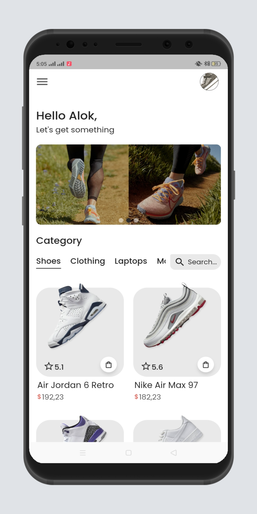
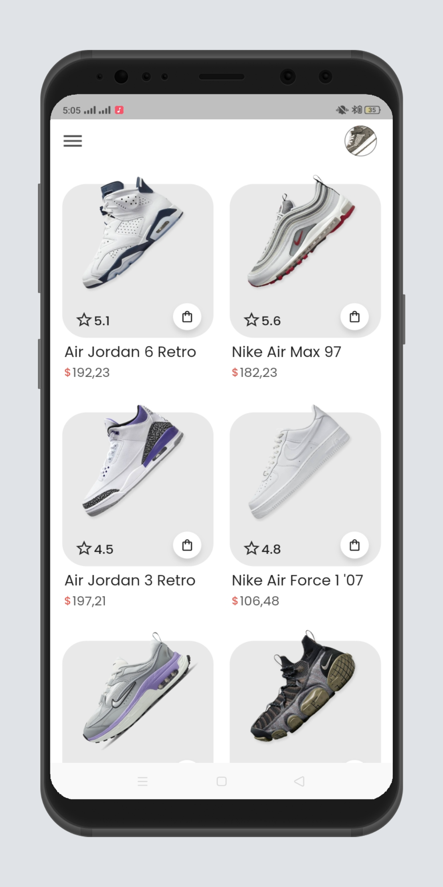
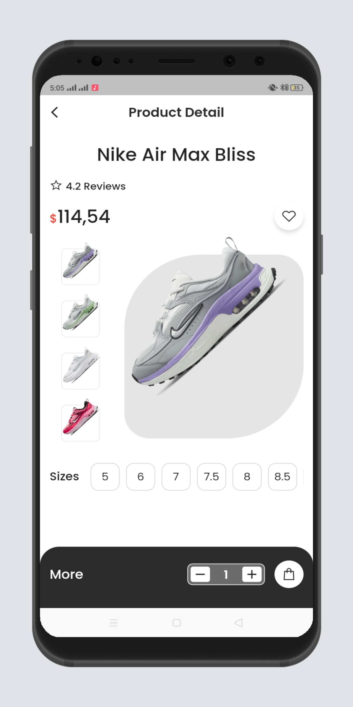
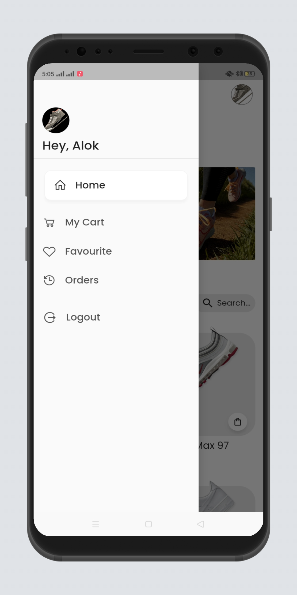
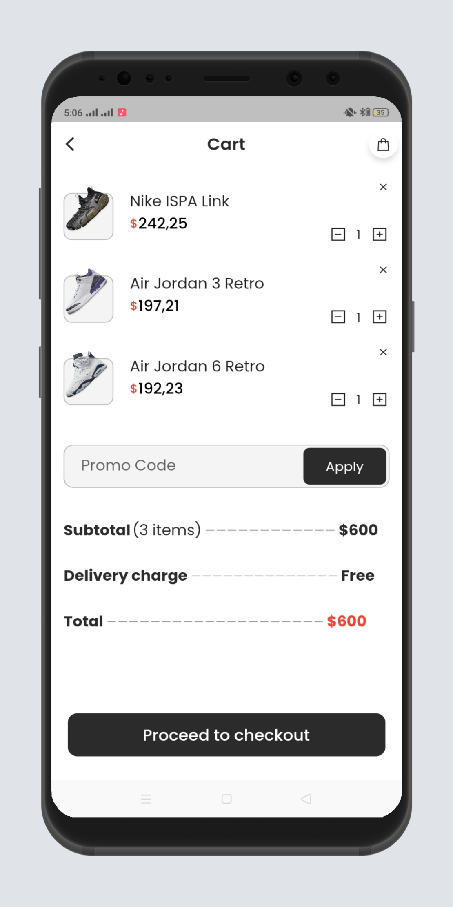
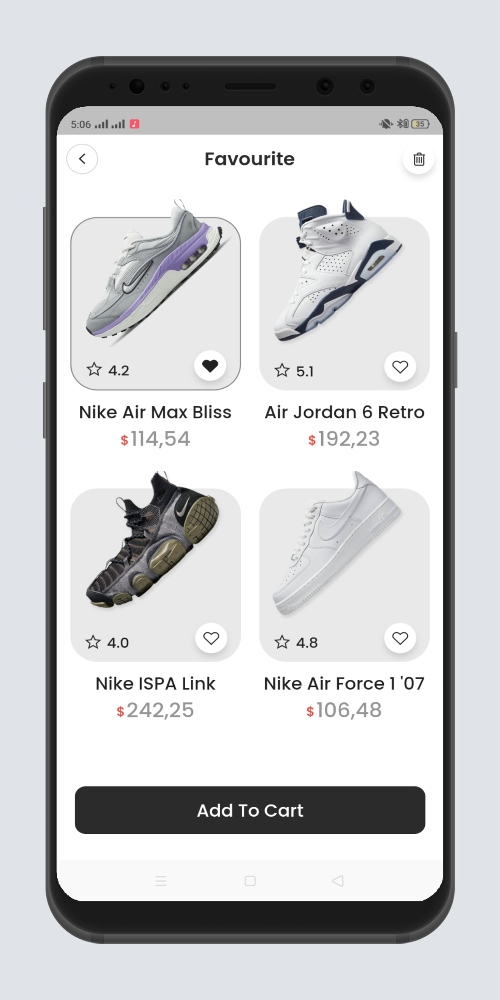
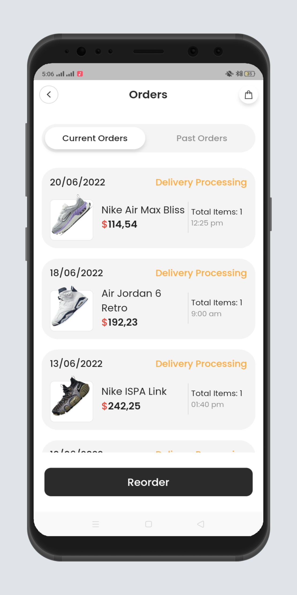
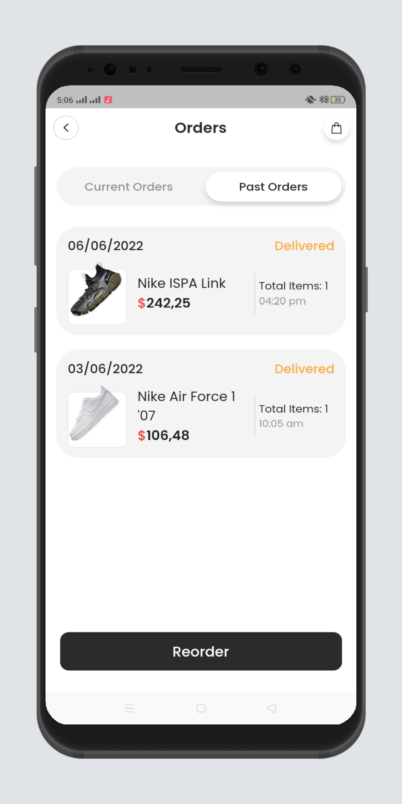

# Ecommerce App UI

Ecommerce App UI

#### Screenshots

<table>
  <tr>
    <td>Home Page</td>
    <td>Home Page</td>
    <td>Detail Page</td>
  </tr>
  <tr>
    <td></td>
    <td></td>
    <td></td>
  </tr>
 </table>

<table>
  <tr>
    <td>Drawer</td>
    <td>Cart Page</td>
    <td>Favourite Page</td>
  </tr>
  <tr>
    <td></td>
    <td></td>
    <td></td>
  </tr>
 </table>

<table>
  <tr>
    <td>Current Orders</td>
    <td>Previous Orders</td>
  </tr>
  <tr>
    <td></td>
    <td></td>
    </tr>
 </table>